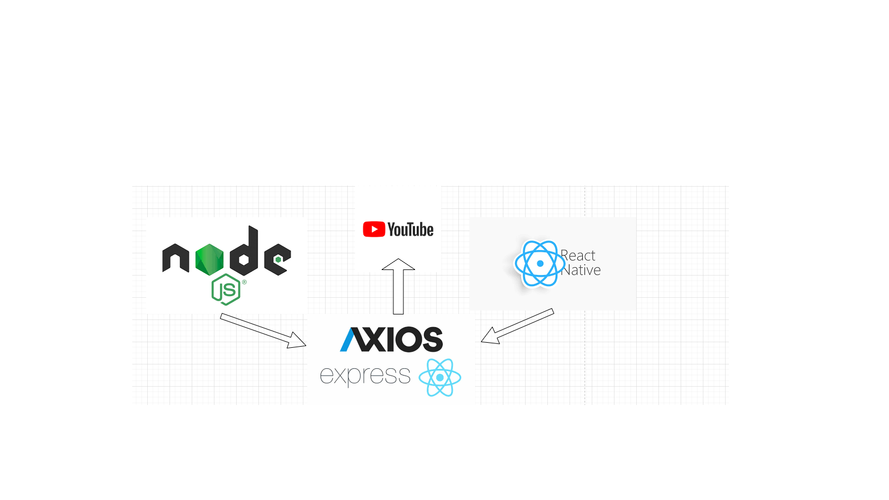

# Senaiflix
App de streaming inspiradno na Netflix.

**Objetivo**
Sistema criado para visualização de vídeos voltados para área da programação.

**Justificativa**

Essa aplicação faz parte de uma atividade das aulas de Desenvolvimento Mobile do curso de Desenvolvimento de Sistemas do Senai.

**Tecnologias**

- React Native
- JavaScript

**Frameworks**

- Expo
- npm

**Arquitetura**

APIs:

- YouTube Data API

**Autor**

Foto | Nome | GitHub | Likedin | E-mail
---- | ---- | ------ | ------- | ------
 | Pedro Henrique Lemos Santos | [PedroHenriqueLS](https://github.com/PedroHenriqueLS) | [Linkedin](https://www.linkedin.com/in/pedro-henrique-santos/) | ph.lemos1165@gmail.com

**Comandos**

* Instalar o Expo-cli:

`npm install -g expo-cli`

* Inicializar uma aplicação

`expo init name_project`

* Instalar dependências

`npm install`

* Start na aplicação

`npm start`